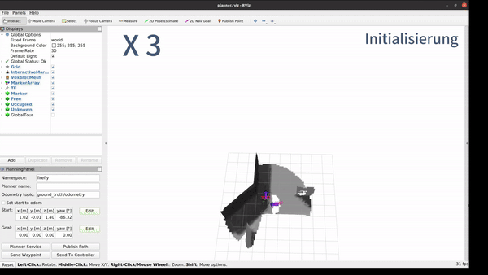

# ScoutAir Planner
Maintainer: Yuchen Xia

## Introduction 
With this Repo, you can ...

<p align="center">

</p>

<!--  -->

<p align="center">

</p>

1. Refering build section fo setup the package:
    - [Prerequisites](#prerequisites)
    - [Build](#build)
    - [Run](#run)

2. Following the brief introduction for


## Prerequisites
1. __Ubuntu and ROS__

   This package is intended to be used with **Ubuntu 20.04** and **ROS Noetic**.

2. __Dependencies__

   First you need to install the following dependencies:

   * [voxblox](https://github.com/ethz-asl/voxblox)   ( See [Installation Dokumentation here](https://voxblox.readthedocs.io/en/latest/pages/Installation.html) )

   (Voxblox: A library for flexible voxel-based mapping, mainly focusing on truncated and Euclidean signed distance fields.)

   * [mav_voxblox_planning](https://github.com/ethz-asl/mav_voxblox_planning?tab=readme-ov-file) 

   (Mav Voxblox Planning: MAV planning tools using voxblox as the map representation.)

   * [rotors_simulator](https://github.com/ethz-asl/rotors_simulator#installation-instructions---ubuntu-1604-with-ros-kinetic) 

   (Rotors Simulator: An MAV simulator built on top of gazebo.This will allow us to fully simulate a typical MAV, with a visual-inertial sensor mounted on it.)

3. __Error or Warning fix__
   1. c++ version:

      Check the compiler version, and if necessary, set the standard to C++14.

      ```
      # add_definitions(-std=c++11 -Wall)
      set(CMAKE_CXX_STANDARD 14)
      set(CMAKE_CXX_STANDARD_REQUIRED ON)
      ```

      Examples: `voxblox_skeleton_planner`, `voxblox_rrt_planner` etc. in `mav_voxblox_planning`; or `rotors_gazebo_plugins` in `rotors_simulator`.

   2. redundant timestamp:
      The `mav_local_planner` demo in `mav_voxblox_planning` is based on ROS package `mav_nonlinear_mpc`(which is still based on ROS package `mav_control_interface` in folder `mav_control_rw`)

      Repo: [mav_control_rw](https://github.com/ethz-asl/mav_control_rw) (Control strategies for rotary wing Micro Aerial Vehicles (MAVs) using ROS)

      ROS package: mav_control_interface (Basic interface that provides ros access to the (position) controller, and takes input from the RC into account.)

      When running the simulation demo, a large number of tf data with the same timestamp are published, resulting in the following errors:
      ```
      [WARN] [1721695180.990697077, 6864.180000000]: TF_REPEATED_DATA ignoring data with redundant timestamp for frame firefly/current_reference (parent odom) at time 6864.178000 according to authority unknown_publisher
      Warning: TF_REPEATED_DATA ignoring data with redundant timestamp for frame firefly/current_reference (parent odom) at time 6864.178000 according to authority unknown_publisher at line 278 in /tmp/binarydeb/ros-noetic-tf2-0.7.7/src/buffer_core.cpp
      ```

      To fix the problem, edit code in the folder `mav_control_rw/mav_control_interface/src/state_machine.cpp` 

      ```
      # transform_broadcaster_.sendTransform( tf::StampedTransform(transform, time_now, reference_frame_id_, nh_.getNamespace() + "/current_reference"));

      static int delay = 0;
      if( delay++ >= 5 ) {
         transform_broadcaster_.sendTransform(
            tf::StampedTransform(transform, time_now, reference_frame_id_, nh_.getNamespace() + "/current_reference"));
         delay = 0;
      }
      ```

   3. launch file:
      Copy launch file `firefly_mapping_planning.launch`, `firefly_sim.launch` in the folder `./launch` to the folder `ros_package[mav_voxblox_planning]/mav_local_planner/launch/`. This tsep is to use parameter settings suitable for `ScoutAir_Planner`.


## Build
Create a ROS workspace:

```
mkdir -p ~/vox_ws/src
```

If already done so, clone repo `ScoutAir_Planner` to your workspace and build packages:

```
cd vox_ws/src
git clone https://...
cd ..

catkin build scoutair_planner
source devel/setup.bash
```


## Run

After compilation running the firefly simulator, by default you can see an Maze-like environment similar to this::

```
roslaunch mav_local_planner firefly_sim.launch

// Due to an oversight by the mav_voxblox_planning developers, you need to publish the 
// following TF in order to receive the ESDF map when using this package.
rosrun tf2_ros static_transform_publisher 0 0 0 0 0 0 firefly/vi_sensor/camera_depth_optical_center_link camera_depth_optical_center_link
```

<p align="center">

</p>

Start a sample exploration demo.

```
roslaunch scoutair_planner frontier.launch
```

Trigger the quadrotor to start exploration by the 2D Nav Goal tool in Rviz. A sample is shown below. 

We can use the Set start to odom option in the planning panel. 
To do this, in the Odometry Topic field, enter `ground_truth/odometry` and check the Set start to odom check-box. 

Now the start location will automatically track the odometry of the Firefly as it moves.

<p align="center">

</p>

First, we need to call the 'Start' ROS Service once to start the autonomous exploration after the initialization, which involves the drone rotating.

Use Ros service to stop / restart ScoutAir Autonomous Planner.

```
rosservice call /firefly/scoutair_planner/pause_planner 
rosservice call /firefly/scoutair_planner/start_planner
```

When ScoutAir Planner is in "Pause" state, you can use rviz tools from mav_voxblox_planning to finish local path planning.


## Parameters

You can change the parameters in `./launch/frontier.launch`.


<p align="center">

</p>


   
