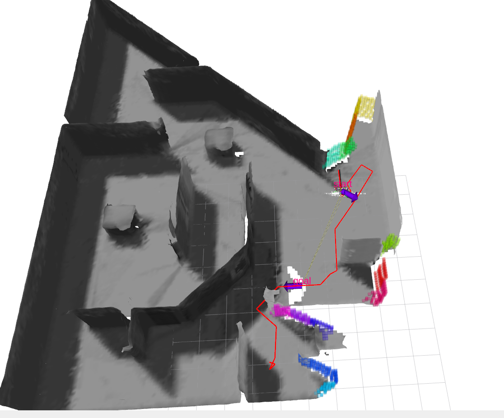

# ScoutAir Planner
Maintainer: Yuchen Xia

## Introduction 

With this Repo, you can ...

1. Refering build section fo setup the package:
    - [Prerequisites](#prerequisites)
    - [Build](#build)
    - [Run](#run)

2. Following the brief introduction for

## Prerequisites
1. __Ubuntu and ROS__

   This package is intended to be used with **Ubuntu 20.04** and **ROS Noetic**.

2. __Dependencies__

   First you need to install the following dependencies:

   * [voxblox](https://github.com/ethz-asl/voxblox)   ( See [Installation Dokumentation here](https://voxblox.readthedocs.io/en/latest/pages/Installation.html) )

   (Voxblox: A library for flexible voxel-based mapping, mainly focusing on truncated and Euclidean signed distance fields.)

   * [rotors_simulator](https://github.com/ethz-asl/rotors_simulator#installation-instructions---ubuntu-1604-with-ros-kinetic) 

   (Rotors Simulator: An MAV simulator built on top of gazebo.This will allow us to fully simulate a typical MAV, with a visual-inertial sensor mounted on it.)

   
