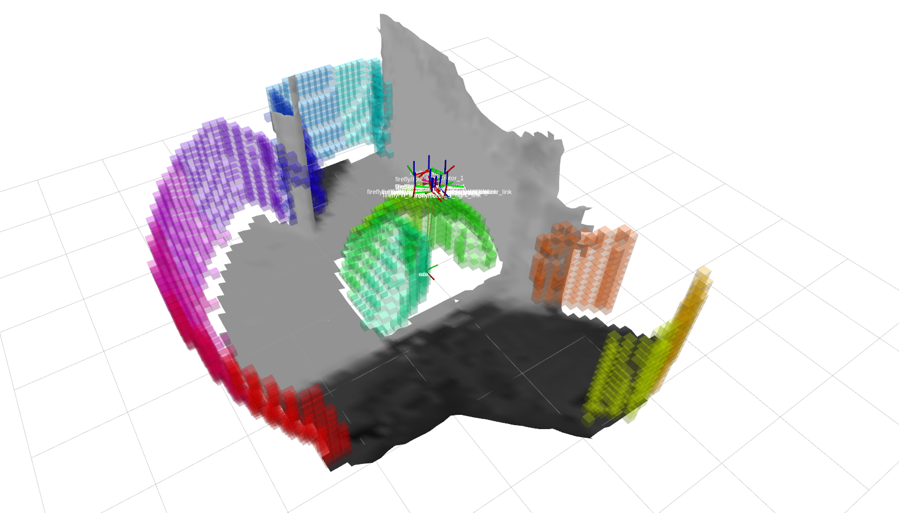

# ScoutAir_Planner
Maintainer: Yuchen Xia

## Introduction 

## Prerequisites
1. __Ubuntu and ROS__

   This package is intended to be used with **Ubuntu 22.04** and **ROS Humble**.

2. __Dependencies__

   
